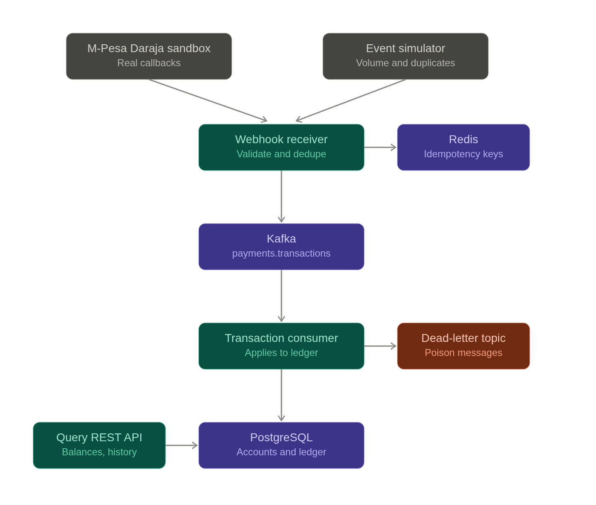
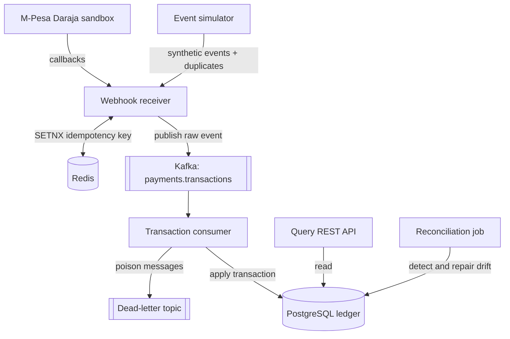

Diagram legend: Teal boxes are services this project implements, purple boxes are infrastructure (Kafka, Redis, Postgres), and gray boxes are external event sources. 

The same thing in Mermaid:

**The event flow, step by step**

1. A payment callback arrives at `POST /webhooks/mpesa` (from Daraja's sandbox).
2. The receiver validates the payload structure and source, then persists the raw JSON to the `raw_events` table before doing anything else. Raw-first means we can always replay.
3. It attempts `SETNX` on the transaction's unique ID in Redis with a TTL. If the key already exists, this is a duplicate: return 200 immediately, process nothing. Returning 200 on duplicates matters, because M-Pesa retries on non-200 and we'd otherwise create a retry storm.
4. On a fresh event, publish to the `payments.transactions` Kafka topic and return 200. The HTTP response never waits on business logic; the receiver's job is capture and acknowledge, fast.
5. The consumer reads from the topic and applies the transaction to the account ledger in Postgres, inside a transaction, using optimistic locking on the account row so concurrent payments to one account don't race.
6. If processing throws, retry with backoff a fixed number of times, then publish to the dead-letter topic with the error attached. Nothing is ever silently dropped.
7. The query API reads balances and transaction history from Postgres. It never touches Kafka.
